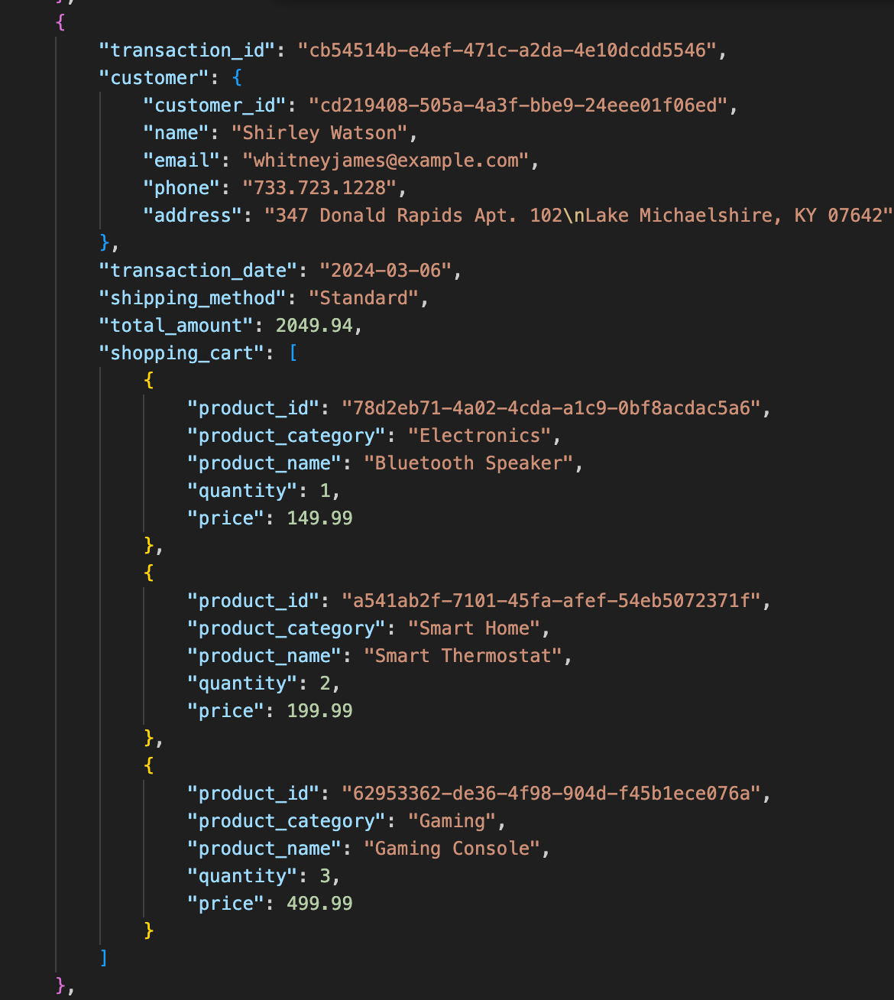

# Data Dictionary for Amazon like Transaction Data
## By: Sylvia Vargas

|Container| Name| description | data example|
| ---- | ---- | ---- | ----|
 || transaction_id| Unique identifier for a purchased transaction|  3029b8f4-6e3f-4807-a070-ac277465a771||
 ||customer| JSON container for customer information
|customer| customer_id| unique customer id| 40f2bf3c-691a-4901-b962-a7f9f8e5ab60|
|customer| name| customer name |  John Mason||
|customer| email| customer email|  ymendoza@example.com|
|customer|phone| customer phone|  +1-361-334-6962x494|
|customer| address|customer full address| 3153 Albert Streets Suite 040\nNorth Kyleton, WI ,22864|
 ||transaction_date|date of customer purchase |2023-12-26|
 ||shipping_method| Shipping Method.  Options include: Standard", "Expedited", "Two-Day", "Overnight" |Standard||
 ||total_amount| Total amount of shopping transaction |  360.08|
 ||shopping_cart|JSON Container for products purchased in transacton.   There are one to many collections in a shopping_cart container. | |
|shopping_cart|    product_id| unique product id| 416f5f88-57c3-4104-8191-f449da408803|
|shopping_cart|  product_name| short name of product purchased | military|
|shopping_cart|               quantity| quantity of items purchased| 2|
|shopping_cart|             price|price of product| 58.41|
